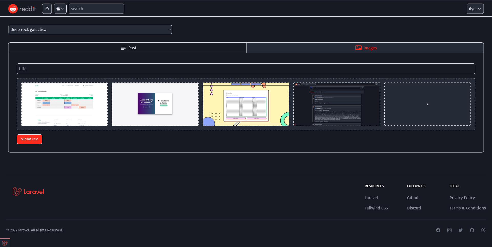

# reddit clone ( an attempt )
Laravel, Livewire, TailwindCSS, MySql, Jquery
incomplete

first project so a lot of glitches and bad practices

## Features
- authentication
- create subs and posts
- text and images and multi images posts
- upvote, downvote
- comment and sub comments
- upvote downvote comments
- bookmarks
- join and leave subs
- load more posts on sccroll

## Screenshots
|   |   |
|---|---|
  |  
  |  
  |  


## Installation

1. install packages
```
npm install
composer install
```

2. create .env from .env.example and change info of mysql database

3. migrate and seed
```
php artisan migrate
php artisan db:seed
```

4. to run 
```
npm run dev
php artisan serve
```

created accounts

email             |  password
:-------------------------:|:-------------------------:
alex@gmail.com  |  password
james@gmail.com  |  password
tomas@gmail.com  |  password

